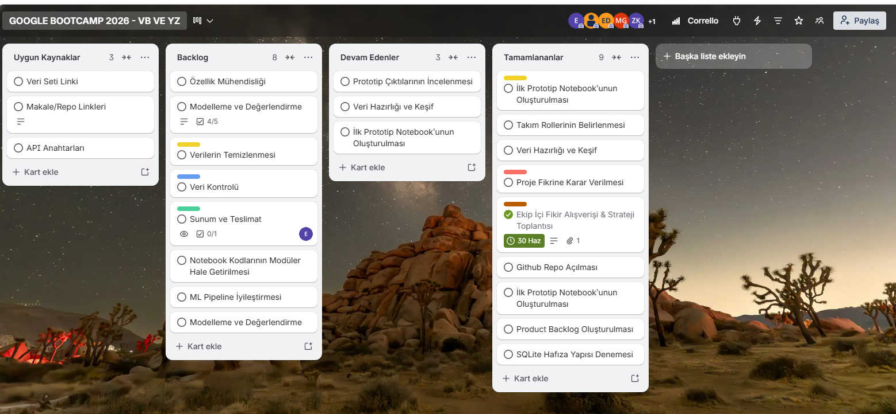

# bootcamp-project
Yapay Zeka Teknoloji Akademisi Bootcamp proje reposu.

# SmartSched - Yapay Zekâ Tabanlı Akıllı Toplantı Asistanı

Yapay Zeka ve Teknoloji Akademisi Bootcamp proje reposu.

## Takım İsmi

Team - 314

## Takım Üyeleri ve Rolleri

| İsim                    | Rol           |
| ----------------------- | ------------- |
| Dilara Şenay            | Scrum Master  |
| Emre Subaşı             | Product Owner |
| Zeynep Buse Kutlu       | Developer     |
| Muhammed Mustafa GÖKTAŞ | Developer     |
| Ezgi Berra Demirel      | Developer     |

---

# Ürünle İlgili Bilgiler

## Ürün İsmi

SmartSched

## Ürün Açıklaması

SmartSched, ekiplerin ortak toplantı zamanı belirlerken yaşadığı zaman kaybını azaltmayı amaçlayan yapay zekâ destekli bir toplantı planlama asistanıdır.

Proje, klasik takvim çakıştırma yaklaşımının ötesine geçerek ekip üyelerinin yoğunluklarını, geçmiş toplantı alışkanlıklarını ve kişisel kısıtlarını dikkate almayı hedefler. Bu sayede ekip için en uygun toplantı zamanının belirlenmesi ve toplantı davet sürecinin daha verimli hale getirilmesi amaçlanmaktadır.

Sprint 1 kapsamında geliştirilen dosyalar ürünün tamamlanmış hali değildir. Bu sprintte proje fikrini doğrulamak ve teknik yaklaşımı test etmek amacıyla ilk prototip çalışmaları yapılmıştır.

## Ürün Özellikleri

* Ekip üyelerinin takvim yoğunluklarını analiz etme
* Ortak boş zaman aralıklarını belirleme
* Geçmiş toplantı verilerine göre toplantı başarı olasılığını tahmin etme
* Kullanıcı kısıtlarını lokal hafıza yapısında saklama
* Toplantı zamanı alternatiflerini puanlama
* Yapay zekâ destekli toplantı davet metni oluşturma
* Streamlit ile arayüz geliştirme hedefi

## Hedef Kitle

* Üniversite proje ekipleri
* Bootcamp ve hackathon takımları
* Uzaktan çalışan küçük ekipler
* Girişim ekipleri
* Scrum/Agile çalışan proje takımları

## Product Backlog URL

[Trello Board] (https://trello.com/b/izmUTa7k/google-bootcamp-2026-vb-ve-yz)

---

# Sprint 1

## Sprint Notları

Sprint 1 kapsamında SmartSched proje fikri netleştirilmiş, takım rolleri belirlenmiş ve projenin ilk teknik yaklaşımı oluşturulmuştur.

Bu sprintte amaç, ürünün final arayüzünü geliştirmek değil; toplantı planlama probleminin veri analizi, makine öğrenmesi ve hafıza yapısı ile çözülebilir olup olmadığını test etmektir.

Bu sprint sonunda ortaya çıkan dosyalar ürünün tamamlanmış hali değil, proje fikrini doğrulamak için hazırlanmış ilk prototip niteliğindedir.

## Backlog Düzeni ve Story Seçimleri

Sprint 1 backlog’u, ürünün temel fikrini doğrulamak ve teknik altyapı için ilk denemeleri yapmak üzere düzenlenmiştir.

Bu sprintte seçilen story’ler; proje fikrinin netleştirilmesi, veri setinin incelenmesi, ilk notebook prototipinin hazırlanması ve hafıza yapısının denenmesi üzerine kurulmuştur.

| Görev                          | Açıklama                                                                    | Durum        |
| ------------------------------ | --------------------------------------------------------------------------- | ------------ |
| Proje fikrinin netleştirilmesi | SmartSched’in problem, çözüm ve hedef kitlesi belirlendi.                   | Tamamlandı   |
| Takım rollerinin belirlenmesi  | Scrum Master, Product Owner ve Developer rolleri netleştirildi.             | Tamamlandı   |
| Veri setinin incelenmesi       | `Project Management (1).csv` dosyası ilk prototip için incelendi.           | Tamamlandı   |
| İlk prototip notebook’u        | `Prototype.ipynb` üzerinde ilk veri işleme ve modelleme denemeleri yapıldı. | Tamamlandı   |
| Hafıza yapısı denemesi         | `smartsched_memory.db` ile SQLite tabanlı lokal hafıza yapısı denendi.      | Tamamlandı   |
| Sprint dokümantasyonu          | Sprint 1 çıktılarının README’ye eklenmesi planlandı.                        | Devam Ediyor |

## Daily Scrum

Daily Scrum süreci ekip üyelerinin uygunluk durumuna göre çevrim içi/asenkron şekilde yürütülmüştür.

Ekip içinde proje fikri, görev paylaşımı, veri seti, prototip geliştirme ve dokümantasyon süreci değerlendirilmiştir.

Daily Scrum sürecinde takip edilen ana başlıklar:

* Proje fikrinin netleştirilmesi
* Ekip rollerinin belirlenmesi
* Kullanılacak veri setinin değerlendirilmesi
* İlk prototip dosyasının hazırlanması
* Sprint 1 dokümantasyonunun oluşturulması

Daily Scrum ekran görüntüleri / toplantı notları:

## SprintBoard ScreenShotları

Sprint 1 görevleri Trello üzerinden takip edilmiştir.

Trello board üzerinde görevler “Yapılacaklar”, “Devam Edenler” ve “Tamamlananlar” şeklinde ayrılmıştır.

Trello Sprint Board ekran görüntüleri:

## Ürün Durumu: Ekran Görüntüleri

Sprint 1 sonunda ürünün kullanıcı arayüzü henüz geliştirilmemiştir. Bu nedenle bu sprintte ürün ekran görüntüsü yerine, projenin ilk teknik prototip durumu dokümante edilmiştir.

Sprint 1 sonunda repoda bulunan temel prototip dosyaları:

* `Project Management (1).csv`: İlk prototipte kullanılan veri dosyası
* `Prototype.ipynb`: Veri işleme, modelleme ve toplantı başarı tahmini denemelerinin yapıldığı notebook
* `smartsched_memory.db`: Kullanıcı kısıtlarını saklamak için denenen SQLite tabanlı lokal hafıza dosyası
* `README.md`: Proje ve Sprint 1 dokümantasyonu

Bu sprintte ürünün final ekranı değil, teknik uygulanabilirliği test edilmiştir. Arayüz ve kullanıcı deneyimi geliştirmeleri Sprint 2 kapsamında planlanmıştır.

## Sprint Review

Sprint 1 sonunda SmartSched fikrinin uygulanabilirliği ilk prototip üzerinden değerlendirilmiştir.

Proje; ekiplerin ortak toplantı zamanı belirleme sürecini kolaylaştıran, veri analizi ve yapay zekâ destekli bir toplantı asistanı olarak konumlandırılmıştır.

Sprint 1’de tamamlanan ana çıktılar:

* Proje fikri netleştirildi.
* Takım rolleri belirlendi.
* İlk veri seti repoya eklendi.
* İlk prototip notebook’u oluşturuldu.
* Makine öğrenmesi yaklaşımı denendi.
* SQLite tabanlı hafıza yapısı test edildi.
* Trello üzerinden görev takibi başlatıldı.

Sprint 2’de arayüz geliştirme, notebook kodlarının daha düzenli hale getirilmesi ve prototipin kullanıcıya gösterilebilir bir yapıya dönüştürülmesi hedeflenmektedir.

## Sprint Retrospective

Sprint 1 sürecinde proje fikri netleştirildi, takım rolleri belirlendi ve ilk prototip çalışmaları başlatıldı. Ürün arayüzü henüz geliştirilmediği için bu sprintte odak noktası veri setinin incelenmesi, notebook üzerinde ilk denemelerin yapılması ve proje yapısının belirlenmesi oldu.

Bir sonraki sprintte prototipin daha düzenli hale getirilmesi, arayüz geliştirmelerine başlanması, verilerin doğruluk payının arttırılması, Sistematik planlamada doğruluk oranının arttılıması hedefleniyor.
